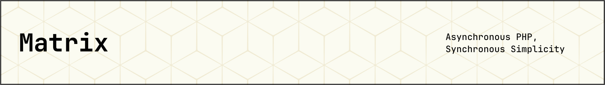

[](https://github.com/Thavarshan/matrix)

# Matrix

[](https://packagist.org/packages/jerome/matrix)
[](https://github.com/Thavarshan/matrix/actions/workflows/tests.yml)
[](https://github.com/Thavarshan/matrix/actions/workflows/lint.yml)
[](https://github.com/Thavarshan/matrix/actions/workflows/github-code-scanning/codeql)
[](https://phpstan.org/)
[](https://packagist.org/packages/jerome/matrix)
[](https://packagist.org/packages/jerome/matrix)
[](https://packagist.org/packages/jerome/matrix)
[](https://github.com/Thavarshan/matrix/stargazers)

Matrix is a PHP library that brings event-driven, asynchronous programming to PHP, inspired by JavaScript's `async`/`await` syntax. Built on top of ReactPHP's event loop, Matrix makes it easier to write non-blocking I/O operations and manage concurrency with a simple, intuitive API.

## Understanding Async in PHP

**Important**: PHP runs in a single-threaded environment. Matrix doesn't create true parallelism but enables **event-driven, non-blocking I/O operations** through ReactPHP's event loop. This means:

- ✅ **Non-blocking I/O**: Network requests, file operations, and timers don't block execution
- ✅ **Concurrent operations**: Multiple I/O operations can run simultaneously
- ❌ **CPU-bound tasks**: Heavy computations will still block the event loop
- ❌ **True parallelism**: No multiple threads or processes

Matrix shines when dealing with I/O-heavy applications like API clients, web scrapers, or microservices.

## Why Choose Matrix?

Matrix simplifies ReactPHP development by providing a familiar async/await syntax while maintaining full compatibility with ReactPHP's ecosystem. It handles the complexity of promise management and event loop integration behind a clean, intuitive API.

### Key Features

- **JavaScript-like API**: Use `async()` and `await()` for straightforward asynchronous programming
- **Powered by ReactPHP**: Built on ReactPHP's battle-tested event loop for true non-blocking I/O
- **Robust Error Handling**: Catch and handle exceptions with `.catch()` or `try-catch`
- **Automatic Loop Management**: The event loop runs automatically to handle promise resolution
- **Concurrent Operations**: Run multiple I/O operations simultaneously
- **Rate Limiting**: Control the frequency of asynchronous operations
- **Promise Cancellation**: Cancel pending operations when they're no longer needed
- **Retry Mechanism**: Automatically retry failed operations with configurable backoff strategies
- **Batch Processing**: Process items in batches for improved performance
- **Enhanced Error Handling**: Add context to errors for better debugging

## Installation

Install Matrix via Composer:

```bash
composer require jerome/matrix
```

### Requirements

- PHP 8.0 or higher
- `sockets` extension enabled

ReactPHP promises and the event loop will be installed automatically via Composer.

## API Overview

### Core Functions

#### `async(callable $callable): PromiseInterface`

Wraps a callable into an asynchronous function that returns a promise.

```php
use function Matrix\async;

$func = async(fn () => 'Success');

$func->then(fn ($value) => echo $value) // Outputs: Success
    ->catch(fn ($e) => echo 'Error: ' . $e->getMessage());
```

#### `await(PromiseInterface $promise, ?float $timeout = null): mixed`

Awaits the resolution of a promise and returns its value. Optionally accepts a timeout in seconds.

```php
use function Matrix\await;

try {
    $result = await(async(fn () => 'Success'));
    echo $result; // Outputs: Success

    // With timeout
    $result = await(async(fn () => sleep(2) && 'Delayed Success'), 3.0);
    echo $result; // Outputs: Delayed Success (or throws TimeoutException if it takes too long)
} catch (\Throwable $e) {
    echo 'Error: ' . $e->getMessage();
}
```

### Promise Combination

#### `all(array $promises): PromiseInterface`

Runs multiple promises concurrently and returns a promise that resolves with an array of all results.

```php
use function Matrix\{async, await, all};

$promises = [
    async(fn () => 'Result 1'),
    async(fn () => 'Result 2'),
    async(fn () => 'Result 3'),
];

$results = await(all($promises));
// $results = ['Result 1', 'Result 2', 'Result 3']
```

#### `race(array $promises): PromiseInterface`

Returns a promise that resolves with the value of the first resolved promise in the array.

```php
use function Matrix\{async, await, race};

$promises = [
    async(function () { sleep(2); return 'Slow'; }),
    async(function () { sleep(1); return 'Medium'; }),
    async(function () { return 'Fast'; }),
];

$result = await(race($promises));
// $result = 'Fast'
```

#### `any(array $promises): PromiseInterface`

Returns a promise that resolves when any promise resolves, or rejects when all promises reject.

```php
use function Matrix\{async, await, any};

$promises = [
    async(function () { throw new \Exception('Error 1'); }),
    async(function () { return 'Success'; }),
    async(function () { throw new \Exception('Error 2'); }),
];

$result = await(any($promises));
// $result = 'Success'
```

### Concurrency Control

#### `map(array $items, callable $callback, int $concurrency = 0, ?callable $onProgress = null): PromiseInterface`

Maps an array of items through an async function with optional concurrency control and progress tracking.

```php
use function Matrix\{async, await, map};
use React\Http\Browser;

$urls = ['https://example.com', 'https://example.org', 'https://example.net'];
$browser = new Browser();

$results = await(map(
    $urls,
    function ($url) use ($browser) {
        // Non-blocking HTTP request
        return $browser->get($url)->then(function ($response) use ($url) {
            return [
                'url' => $url,
                'status' => $response->getStatusCode(),
                'size' => strlen($response->getBody())
            ];
        });
    },
    2, // Process 2 URLs at a time
    function ($done, $total) {
        echo "Processed $done of $total URLs\n";
    }
));

print_r($results); // Array of response data
```

#### `batch(array $items, callable $batchCallback, int $batchSize = 10, int $concurrency = 1): PromiseInterface`

Processes items in batches rather than one at a time for improved performance.

```php
use function Matrix\{async, await, batch};

$items = range(1, 100); // 100 items to process

$results = await(batch(
    $items,
    function ($batch) {
        return async(function () use ($batch) {
            // Process the entire batch at once
            return array_map(fn ($item) => $item * 2, $batch);
        });
    },
    25, // 25 items per batch
    2   // Process 2 batches concurrently
));

print_r($results); // Array of processed items
```

#### `pool(array $callables, int $concurrency = 5, ?callable $onProgress = null): PromiseInterface`

Executes an array of callables with limited concurrency.

```php
use function Matrix\{async, await, pool};

$tasks = [
    fn () => async(fn () => performTask(1)),
    fn () => async(fn () => performTask(2)),
    fn () => async(fn () => performTask(3)),
    // ...more tasks
];

$results = await(pool(
    $tasks,
    3, // Run 3 tasks concurrently
    function ($done, $total) {
        echo "Completed $done of $total tasks\n";
    }
));

print_r($results); // Array of task results
```

### Error Handling and Control

#### `timeout(PromiseInterface $promise, float $seconds, string $message = 'Operation timed out'): PromiseInterface`

Creates a promise that times out after a specified period.

```php
use function Matrix\{async, await, timeout};

try {
    $result = await(timeout(
        async(function () {
            sleep(5); // Long operation
            return 'Done';
        }),
        2.0, // 2 second timeout
        'The operation took too long'
    ));
} catch (\Matrix\Exceptions\TimeoutException $e) {
    echo $e->getMessage(); // "The operation took too long"
    echo "Duration: " . $e->getDuration() . " seconds"; // "Duration: 2 seconds"
}
```

#### `retry(callable $factory, int $maxAttempts = 3, ?callable $backoffStrategy = null): PromiseInterface`

Retries a promise-returning function multiple times until success or max attempts reached.

```php
use function Matrix\{async, await, retry};
use React\Http\Browser;

$browser = new Browser();

try {
    $result = await(retry(
        function () use ($browser) {
            // Non-blocking HTTP request with potential for failure
            return $browser->get('https://unreliable-api.com/data')
                ->then(function ($response) {
                    if ($response->getStatusCode() !== 200) {
                        throw new \RuntimeException('API returned ' . $response->getStatusCode());
                    }
                    return $response->getBody()->getContents();
                });
        },
        5, // Try up to 5 times
        function ($attempt, $error) {
            // Exponential backoff with jitter
            $delay = min(pow(2, $attempt - 1) * 0.1, 5.0) * (0.8 + 0.4 * mt_rand() / mt_getrandmax());
            echo "Attempt $attempt failed: {$error->getMessage()}, retrying in {$delay}s...\n";
            return $delay; // Return null to stop retrying
        }
    ));

    echo "Finally succeeded: $result\n";
} catch (\Matrix\Exceptions\RetryException $e) {
    echo "All {$e->getAttempts()} attempts failed\n";

    foreach ($e->getFailures() as $index => $failure) {
        echo "Failure " . ($index + 1) . ": " . $failure->getMessage() . "\n";
    }
}
```

#### `cancellable(PromiseInterface $promise, callable $onCancel): CancellablePromise`

Creates a cancellable promise with a cleanup function.

```php
use function Matrix\{async, await, cancellable};

// Start a long operation
$operation = async(function () {
    // Simulate long computation
    for ($i = 0; $i < 10; $i++) {
        // Check for cancellation at safe points
        if (/* cancelled check */) {
            throw new \RuntimeException('Operation cancelled');
        }
        sleep(1);
    }
    return 'Completed';
});

// Create a clean-up function for when the operation is cancelled
$cleanup = function () {
    echo "Cleaning up resources...\n";
    // Release any held resources
};

// Create a cancellable promise
$cancellable = cancellable($operation, $cleanup);

// Later, when you need to cancel the operation
$cancellable->cancel();

// Check if it was cancelled
if ($cancellable->isCancelled()) {
    echo "Operation was cancelled.\n";
}
```

#### `withErrorContext(PromiseInterface $promise, string $context): PromiseInterface`

Enhances a promise with additional error context.

```php
use function Matrix\{async, await, withErrorContext};

try {
    await(withErrorContext(
        async(function () {
            throw new \RuntimeException('Database connection failed');
        }),
        'While initializing user service'
    ));
} catch (\Matrix\Exceptions\AsyncException $e) {
    // Outputs: "While initializing user service: Database connection failed"
    echo $e->getMessage() . "\n";

    // Original exception is preserved as the previous exception
    echo "Original error: " . $e->getPrevious()->getMessage() . "\n";
}
```

### Timing and Flow Control

#### `delay(float $seconds, mixed $value = null): PromiseInterface`

Creates a promise that resolves after a specified delay.

```php
use function Matrix\{async, await, delay};

$result = await(delay(2.0, 'Delayed result'));
echo $result; // Outputs: Delayed result (after 2 seconds)

// Can be used in promise chains
async(fn () => 'Step 1')
    ->then(function ($result) {
        echo "$result\n";
        return delay(1.0, $result . ' -> Step 2');
    })
    ->then(function ($result) {
        echo "$result\n";
    });
```

#### `waterfall(array $callables, mixed $initialValue = null): PromiseInterface`

Executes promises in sequence, passing the result of each to the next.

```php
use function Matrix\{async, await, waterfall};

$result = await(waterfall(
    [
        function ($value) {
            return async(fn () => $value . ' -> Step 1');
        },
        function ($value) {
            return async(fn () => $value . ' -> Step 2');
        },
        function ($value) {
            return async(fn () => $value . ' -> Step 3');
        }
    ],
    'Initial value'
));

echo $result; // Outputs: Initial value -> Step 1 -> Step 2 -> Step 3
```

#### `rateLimit(callable $fn, int $maxCalls, float $period): callable`

Creates a rate-limited version of an async function.

```php
use function Matrix\{async, await, rateLimit};
use React\Http\Browser;

$browser = new Browser();

// Create a function that's limited to 2 calls per second
$limitedFetch = rateLimit(
    function ($url) use ($browser) {
        // Non-blocking HTTP request
        return $browser->get($url);
    },
    2,  // Maximum 2 calls
    1.0 // Per 1 second
);

// Make multiple calls
$urls = [
    'https://example.com/api/1',
    'https://example.com/api/2',
    'https://example.com/api/3',
    'https://example.com/api/4',
    'https://example.com/api/5',
];

// These will automatically be rate-limited
foreach ($urls as $url) {
    $limitedFetch($url)->then(function ($response) use ($url) {
        echo "Fetched $url: HTTP " . $response->getStatusCode() . "\n";
    });
}

// Wait for all to complete
await(delay(10)); // Give time for requests to complete
```

## Examples

### Running Asynchronous Tasks

```php
$promise = async(fn () => 'Task Completed');

$promise->then(fn ($value) => echo $value) // Outputs: Task Completed
    ->catch(fn ($e) => echo 'Error: ' . $e->getMessage());
```

### Using the Await Syntax

```php
try {
    $result = await(async(fn () => 'Finished Task'));
    echo $result; // Outputs: Finished Task
} catch (\Throwable $e) {
    echo 'Error: ' . $e->getMessage();
}
```

### Handling Errors

```php
$promise = async(fn () => throw new \RuntimeException('Task Failed'));

$promise->then(fn ($value) => echo $value)
    ->catch(fn ($e) => echo 'Caught Error: ' . $e->getMessage()); // Outputs: Caught Error: Task Failed
```

### Chaining Promises

```php
$promise = async(fn () => 'First Operation')
    ->then(function ($result) {
        echo $result . "\n"; // Outputs: First Operation
        return async(fn () => $result . ' -> Second Operation');
    })
    ->then(function ($result) {
        echo $result; // Outputs: First Operation -> Second Operation
        return $result;
    });

await($promise); // Wait for all operations to complete
```

### Non-blocking HTTP Requests Example

```php
use function Matrix\{async, await, map};
use React\Http\Browser;

// Fetch multiple URLs concurrently using non-blocking requests
$browser = new Browser();
$urls = [
    'https://example.com',
    'https://example.org',
    'https://example.net'
];

$results = await(map(
    $urls,
    function ($url) use ($browser) {
        $start = microtime(true);

        // Non-blocking HTTP request
        return $browser->get($url)->then(function ($response) use ($url, $start) {
            $duration = microtime(true) - $start;

            return [
                'url' => $url,
                'status' => $response->getStatusCode(),
                'size' => strlen($response->getBody()),
                'time' => round($duration, 2) . 's'
            ];
        });
    },
    2 // Process 2 at a time
));

// Display results
foreach ($results as $result) {
    echo "URL: {$result['url']}\n";
    echo "Status: {$result['status']}\n";
    echo "Size: {$result['size']} bytes\n";
    echo "Time: {$result['time']}\n\n";
}
```

### Database Operations Example (using ReactPHP MySQL)

```php
use function Matrix\{async, await, pool};
use React\MySQL\Factory;
use React\MySQL\QueryResult;

// Define database operations as non-blocking tasks
$factory = new Factory();
$connection = $factory->createLazyConnection('user:pass@localhost/test');

$tasks = [
    function () use ($connection) {
        return $connection->query('SELECT * FROM users LIMIT 10')
            ->then(fn (QueryResult $result) => $result->resultRows);
    },
    function () use ($connection) {
        return $connection->query('SELECT * FROM products LIMIT 10')
            ->then(fn (QueryResult $result) => $result->resultRows);
    },
    function () use ($connection) {
        return $connection->query('SELECT * FROM orders LIMIT 10')
            ->then(fn (QueryResult $result) => $result->resultRows);
    }
];

// Execute all database queries concurrently
[$users, $products, $orders] = await(pool($tasks));

// Process the data
echo "Found " . count($users) . " users\n";
echo "Found " . count($products) . " products\n";
echo "Found " . count($orders) . " orders\n";

$connection->quit();
```

### API Integration Example with Retry

```php
use function Matrix\{async, await, batch, retry};
use React\Http\Browser;

// Fetch API data with retry support and batch processing
function fetchApiData($endpoint, $apiToken, $batchSize = 50, $maxBatches = 10) {
    $browser = new Browser();
    $baseUrl = "https://api.example.com";

    // Create batches of requests
    $batches = [];
    for ($i = 0; $i < $maxBatches; $i++) {
        $batches[] = [
            'url' => "{$baseUrl}/{$endpoint}",
            'params' => [
                'offset' => $i * $batchSize,
                'limit' => $batchSize
            ]
        ];
    }

    return await(batch(
        $batches,
        function ($batchItems) use ($browser, $apiToken) {
            return retry(
                function () use ($batchItems, $browser, $apiToken) {
                    $promises = [];

                    foreach ($batchItems as $item) {
                        $url = $item['url'] . '?' . http_build_query($item['params']);

                        $promises[] = $browser->get($url, [
                            'Authorization' => "Bearer {$apiToken}",
                            'Content-Type' => 'application/json'
                        ])->then(function ($response) {
                            if ($response->getStatusCode() !== 200) {
                                throw new \RuntimeException("API request failed with status " . $response->getStatusCode());
                            }

                            $data = json_decode($response->getBody(), true);
                            if (!isset($data['results'])) {
                                throw new \RuntimeException("Unexpected response format");
                            }

                            return $data['results'];
                        });
                    }

                    return all($promises)->then(function ($results) {
                        return array_merge(...$results);
                    });
                },
                3, // 3 retry attempts
                function ($attempt, $error) {
                    echo "API request failed (attempt {$attempt}): {$error->getMessage()}\n";
                    return $attempt * 1.5; // Increasing delay between retries
                }
            );
        },
        2, // 2 items per batch
        3  // 3 concurrent batches
    ));
}

// Usage
try {
    $data = fetchApiData('users', 'your-api-token');
    echo "Fetched " . count($data) . " records\n";

    foreach ($data as $record) {
        echo "- {$record['id']}: {$record['name']}\n";
    }
} catch (\Throwable $e) {
    echo "Error fetching API data: " . $e->getMessage() . "\n";
}
```

## Advanced Testing

Matrix includes a comprehensive test suite to ensure reliability, including:

### Unit Tests

Test individual components in isolation:

```php
public function test_async_returns_promise(): void
{
    $result = async(fn () => 'test');
    $this->assertInstanceOf(PromiseInterface::class, $result);
}
```

### Integration Tests

Test how components work together in real-world scenarios:

```php
public function test_concurrent_operations(): void
{
    $tasks = [
        fn () => async(fn () => 'task1'),
        fn () => async(fn () => 'task2'),
        fn () => async(fn () => 'task3'),
    ];

    $results = await(pool($tasks, 2));
    $this->assertEquals(['task1', 'task2', 'task3'], $results);
}
```

### Error Handling Tests

Test that errors are properly handled and propagated:

```php
public function test_error_context_enhancement(): void
{
    try {
        await(withErrorContext(
            async(fn () => throw new \RuntimeException('Original error')),
            'Error context'
        ));
        $this->fail('Should have thrown an exception');
    } catch (AsyncException $e) {
        $this->assertStringContainsString('Error context', $e->getMessage());
        $this->assertInstanceOf(\RuntimeException::class, $e->getPrevious());
    }
}
```

### Concurrency Pattern Tests

Test various concurrency patterns:

```php
public function test_rate_limiting(): void
{
    $startTime = microtime(true);
    $results = [];

    $limitedFn = rateLimit(
        function ($i) use (&$results) {
            return async(function () use ($i, &$results) {
                $results[] = $i;
                return $i;
            });
        },
        2, // Max 2 calls
        0.5 // Per 0.5 seconds
    );

    $promises = [];
    for ($i = 1; $i <= 5; $i++) {
        $promises[] = $limitedFn($i);
    }

    await(all($promises));
    $duration = microtime(true) - $startTime;

    $this->assertGreaterThanOrEqual(1.0, $duration);
    $this->assertEquals([1, 2, 3, 4, 5], $results);
}
```

## Performance Considerations

- **Event Loop**: Matrix uses ReactPHP's event loop, which should be run only once in your application
- **Blocking Operations**: Avoid CPU-intensive tasks and blocking I/O operations (like `file_get_contents()`, `sleep()`, or database queries without ReactPHP adapters) in async functions as they will block the entire event loop
- **Memory Management**: Be mindful of memory usage when creating many promises, as they remain in memory until resolved
- **Error Handling**: Always handle promise rejections to prevent unhandled promise rejection warnings
- **Concurrency Limits**: Use the concurrency parameters in `map()`, `batch()`, and `pool()` to control resource usage and prevent overwhelming external services
- **Rate Limiting**: Use `rateLimit()` when working with APIs that have rate limits to avoid being throttled

## Common Pitfalls to Avoid

### ❌ Using Blocking Operations

```php
// DON'T - This blocks the entire event loop
$result = await(async(function () {
    return file_get_contents('https://api.example.com'); // Blocking!
}));
```

### ✅ Use Non-blocking Alternatives

```php
// DO - Use ReactPHP's non-blocking HTTP client
use React\Http\Browser;

$browser = new Browser();
$result = await($browser->get('https://api.example.com'));
```

### ❌ CPU-Intensive Operations

```php
// DON'T - Heavy computation blocks the event loop
$result = await(async(function () {
    return array_sum(range(1, 10000000)); // Blocks event loop!
}));
```

### ✅ Break Up Heavy Operations

```php
// DO - Break into smaller chunks or use separate processes
$result = await(async(function () {
    // Process in smaller batches with yields to event loop
    $sum = 0;
    for ($i = 1; $i <= 10000000; $i += 1000) {
        $sum += array_sum(range($i, min($i + 999, 10000000)));
        if ($i % 10000 === 0) {
            // Yield control back to event loop periodically
            await(delay(0.001));
        }
    }
    return $sum;
}));
```

## How It Works

Matrix provides an intuitive async/await interface on top of ReactPHP's powerful event loop system:

1. **Event Loop Management**: The `async()` function schedules work on ReactPHP's event loop, enabling non-blocking execution of I/O operations
2. **Promise Interface**: All async operations return ReactPHP promises with `then()` and `catch()` methods for handling success and error cases
3. **Synchronous Await**: The `await()` function runs the event loop until the promise resolves, providing a synchronous-looking interface
4. **Concurrency Control**: Functions like `map()`, `batch()`, and `pool()` limit concurrent operations to prevent resource exhaustion
5. **Error Handling**: Custom exception classes provide detailed information about failures, timeouts, and retry attempts

**Key Point**: Matrix doesn't change PHP's single-threaded nature but makes it much easier to write efficient, non-blocking I/O code that can handle thousands of concurrent operations.

## Testing

Run the test suite to ensure everything is working as expected:

```bash
composer test
```

## Contributing

We welcome contributions! To get started:

1. Fork the repository
2. Create a feature branch (`git checkout -b feature/amazing-feature`)
3. Commit your changes (`git commit -m 'Add some amazing feature'`)
4. Push to the branch (`git push origin feature/amazing-feature`)
5. Open a Pull Request

Please make sure your code follows the project's coding standards and includes appropriate tests.

## License

Matrix is open-source software licensed under the MIT License.
